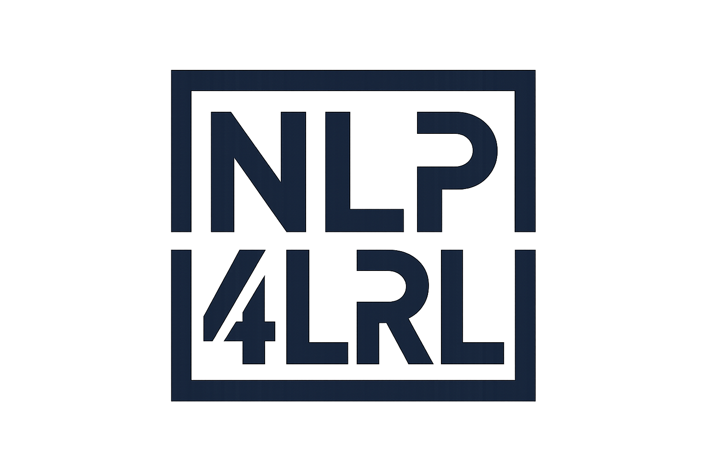

<div align="center">
  
</div>

# NLP4LRL Annotation Platform

[](https://github.com/NLP4LRL/doccano/actions/workflows/ci.yml)

A collaborative data annotation platform for NLP research in low-resource language settings. Built on top of [doccano](https://github.com/doccano/doccano) and customized for the NLP4LRL project.

**Live platform:** [annotate.nlp4lrl.com](https://annotate.nlp4lrl.com)

## Features

- Collaborative annotation with role-based access (admin / annotator)
- Multi-language support — including low-resource and morphologically rich languages
- Annotation types: NER / sequence labeling, text classification, sequence-to-sequence
- Mobile support
- Dark theme
- RESTful API

## Running Locally (from source)

**Requirements:** Python 3.10+, Poetry, Node 18+, Yarn

```bash
git clone https://github.com/NLP4LRL/doccano.git
cd doccano
```

**Backend:**

```bash
cd backend
poetry install
poetry run python manage.py migrate
poetry run python manage.py create_roles
poetry run python manage.py create_admin --noinput \
  --username admin --email admin@example.com --password yourpassword
poetry run python manage.py runserver
```

In a second terminal, start the task worker:

```bash
cd backend
poetry run celery --app=config worker --loglevel=INFO --concurrency=1
```

**Frontend:**

```bash
cd frontend
yarn install
yarn dev   # http://localhost:3000
```

## Production Deployment (Docker Compose)

See [Doccano_Deployment_Notes_NLP4LRL.md](Doccano_Deployment_Notes_NLP4LRL.md) for the full deployment guide including HTTPS setup, nginx configuration, and the Docker image build workflow for the VPS.

```bash
cp docker/.env.example docker/.env
# Edit docker/.env with your credentials
docker compose -f docker/docker-compose.prod.yml up -d
```

The production stack includes: Django + Gunicorn, PostgreSQL, RabbitMQ, Celery, Flower, and Nginx.

## Deploying Frontend Changes

The VPS (2 GB RAM) cannot build Docker images. Build locally and push to Docker Hub:

```bash
docker buildx build \
  --platform linux/amd64 \
  -f docker/Dockerfile.nginx \
  -t billofosuhene/doccano-frontend:nlp4lrl \
  --push \
  .
```

Then on the VPS:

```bash
docker compose -f docker/docker-compose.prod.yml pull nginx
docker compose -f docker/docker-compose.prod.yml up -d nginx
```

## Active Branch

UI customizations live on the `frontend/nlp4lrl-ui-rebrand` branch. See [Doccano_Deployment_Notes_NLP4LRL.md](Doccano_Deployment_Notes_NLP4LRL.md) for a full list of changes made.

## Attribution

This platform is a customized fork of [doccano](https://github.com/doccano/doccano) by Hiroki Nakayama et al. If you use doccano in your research, please cite:

```bibtex
@misc{doccano,
  title={{doccano}: Text Annotation Tool for Human},
  url={https://github.com/doccano/doccano},
  note={Software available from https://github.com/doccano/doccano},
  author={
    Hiroki Nakayama and
    Takahiro Kubo and
    Junya Kamura and
    Yasufumi Taniguchi and
    Xu Liang},
  year={2018},
}
```

## Contact

For questions about the NLP4LRL annotation platform, visit [nlp4lrl.com](https://www.nlp4lrl.com).
